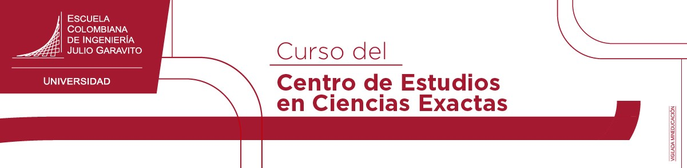
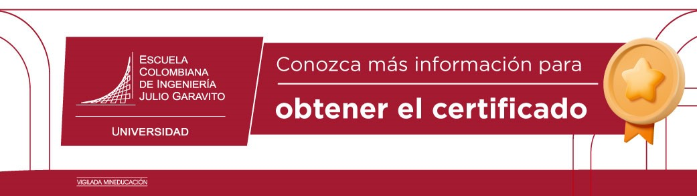

<b> Universidad Escuela Colombiana de Ingeniería Julio Garavito</b>
 

Heindel Ricardo Otero Arévalo
 

Profesor del Centro de Estudios en Ciencias Exactas
 
https://github.com/heindelgithub/ELECTROMAGNETISMO/blob/main/README.md

heindel.otero@escuelaing.edu.co
 

## **ELECTROMAGNETISMO CON AUDIOVISUALES**
### Objetivo.
El objetivo de esta publicación es de presentar un material, que les facilita el estudio a muchas personas

interesadas en tener conocimientos de electromagnetismo, sin asistir a un aula de clase presencial, también,

puede servir como material preparatorio en caso de validación de un curso de electromagnetismo asociado a un

programa de ingeniería.

### Método de enseñanza.
El curso de electromagnetismo que se desarrolla, es con audiovisuales que explican los conceptos teóricos del

electromagnetismo y se refuerza con ejercicios resueltos en los mismos audiovisuales.
### Contenido teórico.
Los temas que se cubren son los siguientes:

Carga eléctrica, fuerza eléctrica, campo eléctrico, potencial eléctrico, capacitancia eléctrica, circuitos con

capacitores, energía almacenada en un condensador, energía de campo eléctrico, transferencia de carga y energía,

corriente eléctrica, resistividad y resistencia eléctrica, ley de Ohm y potencia eléctrica, circuitos con resistencias,

circuito RC, magnetismo, Ley de Biot-Savart y fuerza magnética producida en alambres con corrientes eléctricas.

### TEMAS

1. **CARGA ELÉCTRICA**

Se presenta el concepto de carga eléctrica que hay en el universo:

https://web.microsoftstream.com/video/6e476c8f-fd31-4f05-9e25-b10edb376e3c

Conceptos de vectores unitarios.

https://web.microsoftstream.com/video/307e9459-0aff-4f8b-997a-2b2965675ab9

Ejercicio de carga eléctrica.

https://web.microsoftstream.com/video/10241056-f09b-4dd3-81fe-922f215c64bd

 

2. **FUERZA ELÉCTRICA PRODUCIDA ENTRE CARGAS ELÉCTRICAS**

Se habla acerca de la fuerza eléctrica que hay entre dos o mas cargas eléctricas.

https://web.microsoftstream.com/video/88ec2a58-7f31-453a-88eb-9c76e846b565

 *Método de superposición*.

 Se usa para el cálculo de fuerza eléctrica producida por tres o más cargas eléctricas.

 https://web.microsoftstream.com/video/eea16b79-9e3b-4865-863f-90c6a1e871ae

 

 3. **CAMPO ELÉCTRICO**

 Se introduce el concepto de campo eléctrico con su estructura matemática, producido por cargas eléctricas.

 https://web.microsoftstream.com/video/2936c640-8cd6-4d4c-999c-99f8295240f0

Se estudia el campo eléctrico producido por dos cargas puntuales.

https://web.microsoftstream.com/video/7ee19374-e9a2-4c03-98a0-93155b51e881

 Se analiza el campo eléctrico producido por cargas distribuidas.

 Se define la densidad de carga lineal.

 https://web.microsoftstream.com/video/b32804e5-7e65-45df-9498-4218ca3c5493

 https://web.microsoftstream.com/video/a0d793d0-5724-425e-873e-98c427264218

 Cálculo del campo eléctrico producido por una carga distribuida uniformemente en un alambre recto.

 https://web.microsoftstream.com/video/c778ec91-201e-43a7-b6a9-5dd194c851ec

 Cálculo del campo eléctrico producido por una carga distribuida uniformemente en un alambre en forma de semi aro.

 https://web.microsoftstream.com/video/e1f4d521-132d-4a4f-8c08-ce5e2c9326d2

 *Carga eléctrica distribuida en una superficie*.

 Se define la densidad de carga superficial.

 https://web.microsoftstream.com/video/bff79eee-e0d0-49d6-a1a3-ef009b0a609f

 4. **CONDUCTORES Y DIELÉCTRICOS**

Se presentan los conceptos de carga eléctrica depositada en un material conductor y

carga eléctrica depositada en un material aislante.

 https://web.microsoftstream.com/video/f22dc3f7-3530-4a60-9d27-0c600c95c585

 5. **ENERGÍA POTENCIAL ELÉCTRICA**

Se introduce el concepto y la ecuación matemática de la energía potencial eléctrica.

 https://web.microsoftstream.com/video/6926836f-820b-4684-9e55-aa6f704945f2

 6. **POTENCIAL ELÉCTRICO**

  Definición del potencial eléctrico, con su estructura matemática.

  https://web.microsoftstream.com/video/c9ea292d-b964-4d1e-84af-ff581716429b

  Para reforzar el concepto de potencial eléctrico, se presentan seis ejercicios, que son:

  Ejercicio 6.1

 https://web.microsoftstream.com/video/5ba4d70e-358c-448a-98d6-27157703d63e

 Ejercicio 6.2

 https://web.microsoftstream.com/video/74e3061d-4995-432c-bd89-88768e3a15aa

Ejercicio 6.3

https://web.microsoftstream.com/video/54834746-d3c3-4687-adc2-e055de0f22b3

 Ejercicio 6.4

 https://web.microsoftstream.com/video/2c9667ea-d959-4e69-bcf8-255af164a6f9

 Ejercicio 6.5

 https://web.microsoftstream.com/video/d4ea4a93-710f-4810-9976-cf43940829ed

  Ejercicio 6.6

  https://web.microsoftstream.com/video/a7553c1e-49a1-4c31-8b4c-45127c625637

  7. **RELACIÓN ENTRE POTENCIAL ELÉCTRICO Y CAMPO ELÉCTRICO**

 Existe una relación matemática entre el potencial y el campo eléctrico, que se va a mostrar en el siguiente video.

  https://web.microsoftstream.com/video/f6812777-359d-47ed-8a57-0281369440ab

  8. **CAPACITANCIA ELÉCTRICA**

  Definición de un capacitor o condensador eléctrico y de la capacitancia eléctrica.

   https://web.microsoftstream.com/video/2fc705ac-e025-48f5-b1da-db7994746c1e

  *Capacitores conectados en serie*.

  Se presenta un circuito eléctrico con condensadores conectados en serie, con una fuente de voltaje.

  https://www.screencast.com/t/VGgv9vv3Zdv

   *Capacitores conectados en paralelo*.

   Se presenta un circuito eléctrico con condensadores conectados en paralelo, con una fuente de voltaje.

   https://www.screencast.com/users/heindel.otero/folders/Camtasia%20Studio/media/c045bd6c-3df7-4dd5-a6e2-93c7dbb57edd

   9. **ENERGÍA ALMACENADA EN UN CAPACITOR**

   Se presenta el concepto y la relación matemática de la energía almacenada en un condensador.

   https://spark.adobe.com/video/DwkMa0UQm3xNd

   10. **ENERGÍA DE CAMPO ELÉCTRICO**

   Se presenta la ecuación de la nergía de campo eléctrico, el cual es independiente

   de la forma geométrica del condensador.

   https://spark.adobe.com/video/eMvaF2Ix9dYWy

   11. **TRANSFERENCIA DE CARGA Y ENERGÍA**

   Usando condensadores eléctricos se hace un análisis acerca de la tranferencia de energía, desde

   un condensador hacia otro condensador eléctrico.

   https://express.adobe.com/video/4qwqeJTZYc3nt

   https://spark.adobe.com/video/4qwqeJTZYc3nt

  12. **CAPACITORES CON DIELÉCTRICO**

  Se analiza el efecto físico que produce un dieléctrico, dentro de un condensador o capacitor.

  https://spark.adobe.com/video/pfJd7iSyvJebt

  Condensadores con dieléctricos ejemplo 1.

   https://www.screencast.com/t/55ct21tl

  Condensadores con dieléctricos ejemplo 2

  https://www.screencast.com/t/SEezRisUem6C

 13. **CORRIENTE ELÉCTRICA**

 Se presenta la definición de corriente eléctrica, con su respectiva ecuación matemática.

 https://www.screencast.com/t/H5jz2MvfRK

 14. **RESISTIVIDAD**

 Se da el concepto y la ecuación matemática de resistividad eléctrica.

 https://spark.adobe.com/video/dUVEqMLtTSinh

 15. **RESISTENCIA ELÉCTRICA**

 Se presenta el concepto de resistencia eléctrica y la ecuación matemática.

 https://spark.adobe.com/video/duXHIMjB5IvSU

 16. **LEY DE OHM Y POTENCIA ELÉCTRICA**

 Se presenta la relación entre corriente eléctrica, potencial y resistencia eléctrica.

 https://spark.adobe.com/video/1CQYobvnhPFg0

 *Circuito resistivo en serie*.

Se explica la conexión de resistencias conectadas en serie con una fuente de voltaje.

https://spark.adobe.com/video/AP7oc3d2xpftk

*Circuito resistivo en paralelo*.

Se explica la conexión de resistencias conectadas en paralelo con una fuente de voltaje.

https://spark.adobe.com/video/i2vgrdxMtIWh9

17. **CIRCUITO RC**

Se hace un análisis detallado del circuito en serie, compuesto por un condensador,

una resistencia eléctrica y una fuente de voltaje.

 https://spark.adobe.com/video/yYXJ5T1sRpWme

18. **MAGNETISMO**

Se presenta el concepto de magnetismo y las fuentes que lo generan.

 https://www.screencast.com/t/vgOOW5xb

19. **CAMPO MAGNÉTICO PRODUCIDO POR UNA CORRIENTE ELÉCTRICA**.

*Ley de Biot-Savart*

Esta ley permite hacer cálculos de campos magnéticos producidos por corrientes eléctricas.

https://www.screencast.com/t/pWzCoYn2Bq5

20. **FUERZA MAGNÉTICA**

Se hace un análisis de la fuerza magnética producida en alambres que llevan corriente eléctrica.

 https://www.screencast.com/t/hdiyiKOT

*Fuerza magnética en un alambre con corriente eléctrica*.

https://www.screencast.com/t/6hULkXNkL

